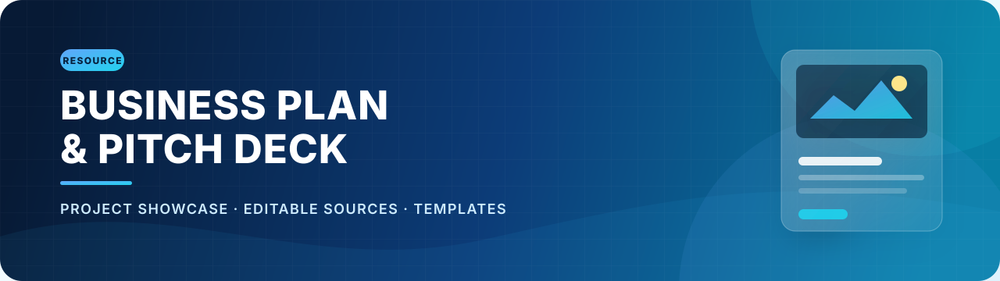
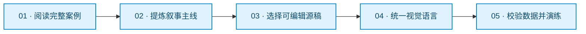
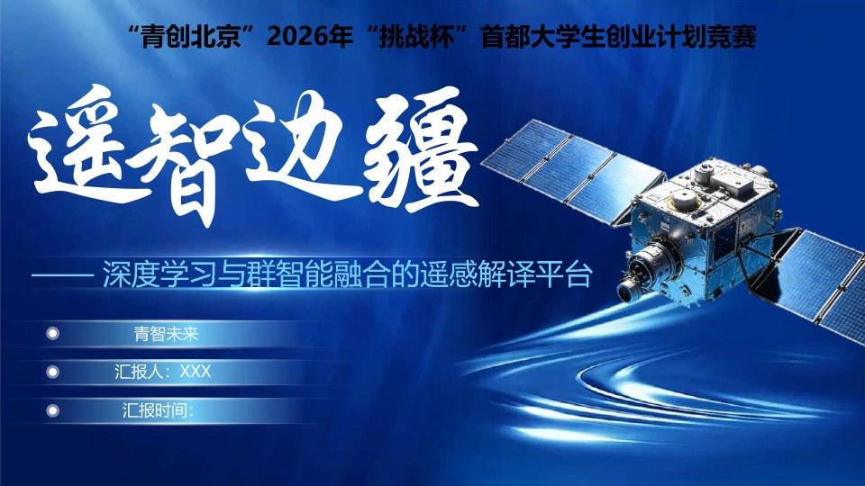
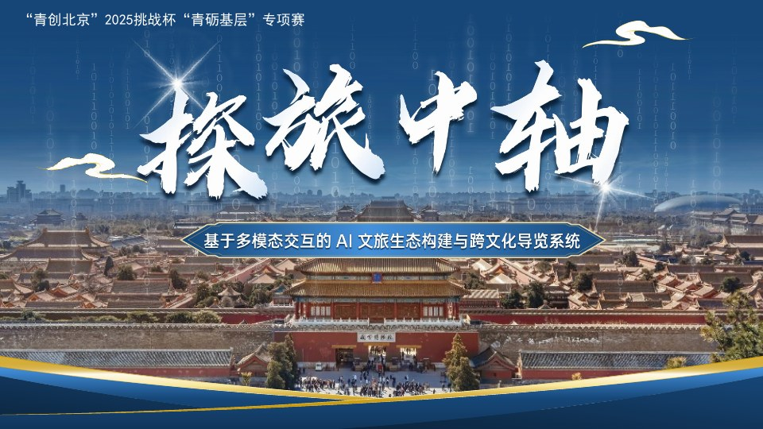
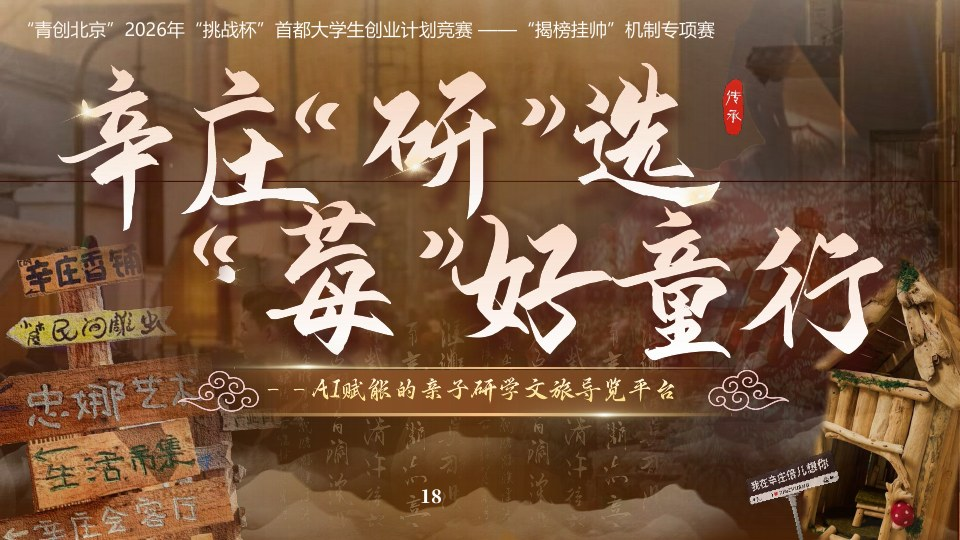

<div align="center">
  
</div>

<h1 align="center">商业计划书 &amp; 路演 PPT 素材库</h1>

<p align="center">
  <strong>把复杂项目，讲成一个清晰、可信、打动人的故事。</strong>
</p>

<div align="center">
  <a href="https://github.com/KarlHeinrich-jpg/Business-Plan-and-PPT/stargazers"></a>
  <a href="https://github.com/KarlHeinrich-jpg/Business-Plan-and-PPT/commits/main"></a>
  
  
  
</div>

<p align="center">
  面向「挑战杯 / 创业计划竞赛 / 大创答辩 / 项目路演」的商业计划书与演示文稿参考库。<br />
  收录完整项目案例、可编辑 Word / PowerPoint 源文件，以及多种风格的 PPT 模板。
</p>

<p align="center">
  <a href="#-资源概览">资源概览</a> ·
  <a href="#-推荐拆解路径">推荐路径</a> ·
  <a href="#-完整案例">完整案例</a> ·
  <a href="#-可编辑项目源文件">可编辑源文件</a> ·
  <a href="#-ppt-设计模板">PPT 模板</a> ·
  <a href="#-使用指南">使用指南</a>
</p>

> [!TIP]
> 本仓库适合用来拆解优秀项目的叙事逻辑、页面结构和视觉表达。建议吸收方法后结合自己的调研、数据与项目特色重新创作。

## ✨ 资源概览

| 资源类型 | 数量 | 你可以获得 |
| :--- | :---: | :--- |
| 完整项目案例 | **3 份** | 从项目背景、痛点分析到商业模式、社会价值与团队展示的完整叙事参考 |
| 可编辑项目源文件 | **4 份** | 2 份 `.pptx` 演示稿与 2 份 `.docx` 计划书，可直接拆解学习 |
| PPT 设计模板 | **3 套** | 科技蓝、材料创业、蓝白医疗等不同视觉方向 |
| 涵盖主题 | **AI × 多领域** | 遥感解译、智慧文旅、亲子研学、地貌监测等方向 |

## 🧭 推荐拆解路径



先理解案例为什么成立，再复用它的表达方法。最终稿应当来自你自己的真实调研、数据论证与项目判断，而不是简单替换模板文字。

## 🖼️ 完整案例

| 项目预览 | 项目简介 | 文件信息 |
| :---: | :--- | :---: |
| <a href="./581002-遥智边疆——深度学习_感解译平台-项目作品-89b09fad%20%281%29.pdf"></a> | **遥智边疆**<br />深度学习与群智能融合的遥感解译平台，围绕边疆复杂环境下的多任务遥感信息提取展开。<br /><br />`AI` `遥感解译` `商业航天` | **PDF · 88 页**<br />18.7 MiB<br /><br />[打开文件](<./581002-遥智边疆——深度学习_感解译平台-项目作品-89b09fad (1).pdf>) |
| <a href="./探旅中轴ppt+计划书终版.pdf"></a> | **探旅中轴**<br />基于多模态交互的 AI 文旅生态构建与跨文化导览系统，聚焦北京中轴线数字文旅体验。<br /><br />`AI 文旅` `多模态交互` `跨文化导览` | **PDF · 110 页**<br />22.9 MiB<br /><br />[打开文件](<./探旅中轴ppt+计划书终版.pdf>) |
| <a href="./辛庄“研”选，“莓”好童行——AI赋能的亲子研学文旅导览平台校赛.pdf"></a> | **辛庄「研」选，「莓」好童行**<br />AI 赋能的亲子研学文旅导览平台，探索乡村文旅、非遗体验与研学服务的数字化升级。<br /><br />`乡村振兴` `亲子研学` `智慧导览` | **PDF · 113 页**<br />56.5 MiB<br /><br />[打开文件](<./辛庄“研”选，“莓”好童行——AI赋能的亲子研学文旅导览平台校赛.pdf>) |

## 🧩 可编辑项目源文件

### 项目十三 · 遥智边疆

聚焦国产商业卫星数据与复杂边疆场景，通过深度学习、传统遥感方法和群智能优化实现多任务解译。

| 文件 | 格式 | 规格 | 大小 |
| :--- | :---: | :---: | ---: |
| [项目十三 · 路演 PPT](<./可编辑版本模板/项目13PPT.pptx>) | PowerPoint | 8 页 | 6.7 MiB |
| [项目十三 · 商业计划书](<./可编辑版本模板/项目十三4.20.docx>) | Word | 74 页 | 8.5 MiB |
| [项目十三 · 计划书预览版](<./可编辑版本模板/项目十三-pdf.pdf>) | PDF | 73 页 | 2.5 MiB |

### 项目十四 · 地脉灵犀

多尺度天空地一体化地貌智能监测预警系统，覆盖多源时空数据融合、AI 解译、风险评估与可视化平台设计。

| 文件 | 格式 | 规格 | 大小 |
| :--- | :---: | :---: | ---: |
| [项目十四 · 路演 PPT](<./可编辑版本模板/项目14PPT5.10.pptx>) | PowerPoint | 18 页 | 69.6 MiB |
| [项目十四 · 商业计划书](<./可编辑版本模板/项目14计划书.docx>) | Word | 40 页 | 5.3 MiB |

## 🎨 PPT 设计模板

| 模板 | 视觉方向 | 页数 | 大小 | 下载 |
| :--- | :--- | :---: | ---: | :---: |
| 高端图文排版手册 | 科技蓝 / 商务 / 图文排版，并附使用说明与备用图标 | 112 页 | 75.8 MiB | [PPTX](<./ppt模板/01蓝色版-高端图文排版手册【乐演设计PPT】(1).pptx>) |
| 石破天金 | 材料科技 / 创业竞赛 / 工业质感 | 22 页 | 96.0 MiB | [PPTX](<./ppt模板/石破天金.pptx>) |
| 蓝白色医疗 | 医疗科技 / 清爽蓝白 / 项目路演 | 15 页 | 24.0 MiB | [PPTX](<./ppt模板/蓝白色医疗.pptx>) |

## 🚀 使用指南

### 1. 获取仓库

```bash
git clone --depth 1 https://github.com/KarlHeinrich-jpg/Business-Plan-and-PPT.git
```

也可以点击 GitHub 页面右上角的 **Code → Download ZIP**，或直接点击上方表格中的文件链接单独下载。

### 2. 选择参考方式

- **准备参赛项目**：先阅读完整案例，重点拆解“背景—痛点—方案—壁垒—落地—价值”的叙事链条。
- **快速制作路演稿**：选择接近项目气质的 PPT 模板，统一主题色、字体、图表和图片风格。
- **撰写商业计划书**：参考可编辑 Word 的章节层级，再根据最新赛制要求调整目录和篇幅。
- **准备现场答辩**：将展示页压缩到核心信息，确保每一页都能服务于你的口头表达。

### 3. 使用前检查

- 建议使用 **Microsoft Office 2019 或更高版本**打开 PPT，低版本 Office 或 WPS 可能出现字体、动画或版式差异。
- 替换模板中的姓名、学校、联系方式、占位符和示例数据，避免遗漏个人信息。
- 对政策、市场规模、调研数据和引用来源进行二次核验，确保内容真实且时效有效。
- 检查图片、字体、图标与模板素材的授权范围，再用于公开发布或商业场景。

<details>
<summary><strong>📁 查看仓库结构</strong></summary>

```text
Business-Plan-and-PPT/
├── README.md
├── assets/
│   ├── readme-banner.svg
│   └── previews/
├── 581002-遥智边疆——深度学习_感解译平台-项目作品-89b09fad (1).pdf
├── 探旅中轴ppt+计划书终版.pdf
├── 辛庄“研”选，“莓”好童行——AI赋能的亲子研学文旅导览平台校赛.pdf
├── ppt模板/
│   ├── 01蓝色版-高端图文排版手册【乐演设计PPT】(1).pptx
│   ├── 石破天金.pptx
│   └── 蓝白色医疗.pptx
└── 可编辑版本模板/
    ├── 项目13PPT.pptx
    ├── 项目十三4.20.docx
    ├── 项目十三-pdf.pdf
    ├── 项目14PPT5.10.pptx
    └── 项目14计划书.docx
```

</details>

## ⚠️ 使用说明

本仓库内容仅供学习、交流与结构参考。请勿直接冒用案例中的项目成果、调研数据或团队信息参加比赛；在公开展示、二次分发或商业使用前，请自行确认其中图片、字体、模板及其他第三方素材的授权状态。

仓库当前未声明开源许可证，这意味着内容并不自动获得复制、修改或再分发授权。如需超出合理学习参考范围使用，请先联系仓库作者取得许可。

---

<div align="center">
  <strong>如果这些资料对你有帮助，欢迎点亮一个 ⭐ Star</strong>
  <br /><br />
  <sub>让好内容被更多认真做项目的人看见。</sub>
</div>
